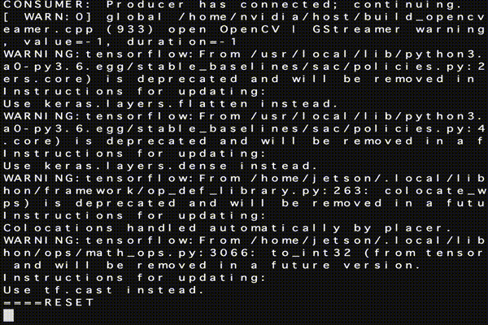
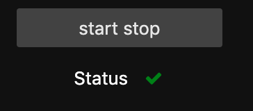
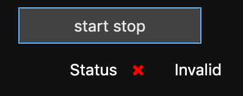

LearningRacer-rl
======

Overview

This software is able to self learning your AI Robocar by Deep reinforcement learning in few minutes.


You can use to Real Robocar and DonkeySim [See in](#simulator).

## 1. Description

Many DIY self driving car like JetBot or JetRacer, DonkeyCar are  using behavior cloning  by supervised-learning.
The method need much labeled data that is collected by human demonstration.  Human driving techniques is very important in this case.

On the other hands, In this software using deep reinforcement learning (DRL). 
That is can earned running behavior automatically through interaction with environment. Do not need sample data that is human labelling.

In addition this software agent can run on the Jetson Nano. Why can run on Jetson Nano and short learning time? because using integrate of SAC[soft actor critic] and VAE. SAC is a state of the art off-policy reinforcement learning method.
In addition VAE train on cloud server beforehand as CNN layer of SAC.(This method called state representation learning) .


* This method devised by Antonin RAFFIN
    * [Arrafine's Medium blog post](https://towardsdatascience.com/learning-to-drive-smoothly-in-minutes-450a7cdb35f4)
    * [Arrafine's implementsation for Simulator](https://github.com/araffin/learning-to-drive-in-5-minutes)


* Detail of SAC here:
    * [Google AI blog Soft Actor-Critic: Deep Reinforcement Learning for Robotics](https://ai.googleblog.com/2019/01/soft-actor-critic-deep-reinforcement.html)

## 2. Demo

This demo video showed that JetBot can earned policy of running road under 30 minutes. Only using Jetson Nano. 

[](https://www.youtube.com/watch?v=j8rSWvcO-s4)


## 3. Setup

### 3.1 Requirements

* Jetbot or JetRacer
 * JetPack 4.2 <=
 * Python 3.6 <=
 * pip 19.3.1 <=

* Windows, macOS or Ubuntu (DonkeySim only)
 * x86-64 arch
 * Python 3.6 <=
 * pip 19.3.1 <=
 * DonkeySIM
 * Optional CUDA10.1(Windows and using GPU.)

### 3.2 Install

* JetBot and JetRacer.

```
$ cd ~/ && git clone https://github.com/masato-ka/airc-rl-agent.git
$ cd airc-rl-agent
$ sh install_jetpack.sh
```

* Other platform(DonkeySIM only).

```
$ cd ~/ && git clone https://github.com/masato-ka/airc-rl-agent.git
$ cd airc-rl-agent
$ sudo pip3 install .\[choose platform\]
```

* You can choose platform from here
    * windows
    * windows-gpu
    * osx
    * ubuntu


When complete install please check run command.

```shell
$ racer --version
learning_racer version 1.0.0 .
```

## 4. Usage

### 4.1 JetBot and JetRacer

#### Create VAE Model

If you have LEGO city raods, Skip this section.
You can get pre-trained VAE model for LEGO city with JetBot. from [here](https://drive.google.com/open?id=1XyptXVAChDQDU6Z-UgUYFMCBaqy4is1S)

```shell
$wget "https://drive.google.com/uc?export=download&id=1XyptXVAChDQDU6Z-UgUYFMCBaqy4is1S" -O vae.torch
```

1. Collect 1k to 10 k images from your car camera using ```data_collection.ipynb``` or ```data_collection_without_gamepad.ipynb```in ```notebook/utility/jetbot```.
   If you use on JetRacer, use```notebook/utility/jetracer/data_collection.ipynb``` . 
2. Learning VAE using ```VAE CNN.ipynb``` on Google Colaboratory.
3. Download vae.torch from host machine and deploy to root directory.

#### Check and Evaluation


Run ```notebooks/util/jetbot_vae_viewer.ipynb``` and Check reconstruction image.
Check that the image is reconstructed at several places on the course.

If you use on JetRacer, Using ```jetracer_vae_viewer.ipynb``` .

* Left is an actual image. Right is reconstruction image.
* Color bar is represented latent variable of VAE(z=32 dim).


#### Start learning

1. Run user_interface.ipynb (needs gamepad).
If you not have gamepad, use ```user_interface_without_gamepad.ipynb```
2. Run train.py

```shell
$ racer train -robot jetbot
# If you use on JetRacer, "-robot jetracer". default is jetbot.
```

After few minutes, the AI car starts running. Please push STOP button immediately before the course out. 
Then, after `` `RESET``` is displayed at the prompt, press the START button. Repeat this.



When you use without_gamepad, you can check status using Validation box.

|Can run                          | Waiting learning                       |
|:-------------------------------:|:--------------------------------------:|
|| |

* racer train command options

|Name           | description            |Default                |
|:--------------|:-----------------------|:----------------------|
|-config(--config-path)| Specify the file path of config.yml.    | config.yml             |
|-vae(--vae-path)| Specify the file path of the trained VAE model.    | vae.torch             |
|-device(--device)|Specifies whether Pytorch uses CUDA. Set 'cuda' to use. Set 'cpu' when using CPU.| cuda                 |
|-robot(--robot-driver)| Specify the type of car to use. JetBot and JetRacer can be specified.| JetBot              |
|-steps(--time-steps)| Specify the maximum learning step for reinforcement learning. Modify the values ​​according to the size and complexity of the course.| 5000 |
|-save_freq(--save_freq_episode) | 
Specify how many episodes to save the policy model. The policy starts saving after the gradient calculation starts.| 10|
|-s(--save)    | Specify the path and file name to save the model file of the training result.  | model                 |
|-l(--load-model)|Define pre-train model path.|-|

#### Running DEMO

When only inference, run below command, The script load VAE model and RL model and start running your car.

```shell
$ racer demo -robot jetbot
``` 

* racer demo command options

|Name           | description            |Default                |
|:--------------|:-----------------------|:----------------------|
|-config(--config-path)| Specify the file path of config.yml.    | config.yml             |
|-vae(--vae-path)| Specify the file path of the trained VAE model.    | vae.torch             |
|-model(--model-path|Specify the file to load the trained reinforcement learning model.|model|
|-device(--device)|Specifies whether Pytorch uses CUDA. Set 'cuda' to use. Set 'cpu' when using CPU.| cuda                 |
|-robot(--robot-driver)| Specify the type of car to use. JetBot and JetRacer can be specified.| JetBot              |
|-steps(--time-steps)| Specify the maximum step for demo. Modify the values ​​according to the size and complexity of the course.| 5000 |


In below command, run the demo 1000 steps with model file name is model.

```shell
$ racer demo -robot jetbot -steps 1000 -model model
```

### <a name="simulator"></a> 4.1 Simulator

#### Download VAE model.

You can get pre-trained VAE model. from [here](https://drive.google.com/open?id=19r1yuwiRGGV-BjzjoCzwX8zmA8ZKFNcC)

```shell
$wget "https://drive.google.com/uc?export=download&id=19r1yuwiRGGV-BjzjoCzwX8zmA8ZKFNcC" -O vae.torch
```

#### Start learning

```shell
$ racer train -robot sim -vae <downloaded vae model path> -device cpu -host <DonkeySim IP>
```

* racer train options

|Name           | description            |Default                |
|:--------------|:-----------------------|:----------------------|
|-config(--config-path)| Specify the file path of config.yml.    | config.yml             |
|-vae(--vae-path)| Specify the file path of the trained VAE model.    | vae.torch             |
|-device(--device)|Specifies whether Pytorch uses CUDA. Set 'cuda' to use. Set 'cpu' when using CPU.| cuda                 |
|-robot(--robot-driver)| Specify the type of car to use. JetBot and JetRacer can be specified.| JetBot              |
|-steps(--time-steps)| Specify the maximum learning step for reinforcement learning. Modify the values ​​according to the size and complexity of the course.| 5000 |
|-save_freq(--save_freq_episode) |
Specify how many episodes to save the policy model. The policy starts saving after the gradient calculation starts.| 10|
|-host(--sim-host)|Define host IP of DonkeySim host.|127.0.0,1|
|-port(--sim-port)|Define port number of DonkeySim host.|9091|
|-track(--sim-track)|Define track name for DonkeySim.|donkey-generated-trach-v0|
|-s(--save)    | Specify the path and file name to save the model file of the training result.  | model                 |
|-l(--load-model)|Define pre-train model path.|-|

#### Start Demo

```shell
$ racer demo -robot sim -model <own trained model path> -vae <downloaded vae model path> -steps 1000 -device cpu -host <DonkeySim IP> -user <your own name>
```

* racer demo options

|Name           | description            |Default                |
|:--------------|:-----------------------|:----------------------|
|-config(--config-path)| Specify the file path of config.yml.    | config.yml             |
|-vae(--vae-path)| Specify the file path of the trained VAE model.    | vae.torch             |
|-model(--model-path|Specify the file to load the trained reinforcement learning model.|model|
|-device(--device)|Specifies whether Pytorch uses CUDA. Set 'cuda' to use. Set 'cpu' when using CPU.| cuda                 |
|-robot(--robot-driver)| Specify the type of car to use. JetBot and JetRacer can be specified.| JetBot              |
|-steps(--time-steps)| Specify the maximum step for demo. Modify the values ​​according to the size and complexity of the course.| 5000 |
|-host(--sim-host)|Define host IP of DonkeySim host.|127.0.0,1|
|-port(--sim-port)|Define port number of DonkeySim host.|9091|
|-track(--sim-track)|Define track name for DonkeySim.|donkey-generated-trach-v0|
|-user(--sim-user)  |Define user name for own car that showed DonkeySim |anonymous|
|-car(--sim-car)    | Define car model type for own car that showed DonkeySim|Donkey|

## 5. Appendix

### 5.1 Configuration

You can configuration to some hyper parameter using config.yml.

|Section          |Parameter              |Description               |
|:----------------|:----------------------|:-------------------------|
|SAC_SETTING      |LOG_INTERVAL           | [Reference to stable baselines document.](https://stable-baselines.readthedocs.io/en/master/modules/sac.html)             |
|^                |VERBOSE                | ^                        |
|^                |LERNING_RATE           | ^                        |
|^                |ENT_COEF               | ^                        |
|^                |TRAIN_FREQ             | ^                        |
|^                |BATCH_SIZE             | ^                        |
|^                |GRADIENT_STEPS         | ^                        |
|^                |LEARNING_STARTS        | ^                        |
|^                |BUFFER_SIZE            | ^                        |
|^                |VARIANTS_SIZE          | Define size of VAE latent|
|^                |IMAGE_CHANNELS         | Number of image channel. |
|REWARD_SETTING   |REWARD_CRASH           | Define reward when crash.|
|^                |CRASH_REWARD_WEIGHT    | Weight of crash reward.   |
|^                |THROTTLE_REWARD_WEIGHT | Weight of reward for speed. |
|AGENT_SETTING    |N_COMMAND_HISTORY      | Number of length command history as observation.|
|^                |MIN_STEERING           | min value of agent steering.|
|^                |MAX_STEERING           | max value of agent steering.|
|^                |MIN_THROTTLE           | min value of agent throttle.|
|^                |MAX_THROTTLE           | max value of agent throttle.|
|^                |MAX_STEERING_DIFF      | max value of steering diff each steps.| 


## 6. Release note

* 2020/03/08 Alpha release
    * First release.
    
* 2020/03/16 Alpha-0.0.1 release
    * Fix import error at jetbot_data_collection.ipynb.

* 2020/03/23 Beta release
    * VAE Viewer can see latent space.
    * Avoid stable_baseline source code change at install.
    * train.py and demo.py merged to racer.py.
    * Available without a game controller.
    * Fix for can not copy dataset from google drive in CNN_VAE.ipynb

* 2020/03/23 Beta-0.0.1 release
    * Fix VAE_CNN.ipynb (bug #18).

* 2020/04/26 v1.0.0 release
    * Improvement install function.
    * Can use DonkeySIM.
    * YAML base configuration.
    * Can use pre-trained model for SAC.
    * Periodical saved model in each specific episode.

## 7. Contribution

* If you find bug or want to new functions, please write issue.
* If you fix your self, please fork and send pull request.

## LICENSE

This software license under [MIT](https://github.com/masato-ka/airc-rl-agent/blob/master/LICENCE) licence.

## Author

[masato-ka](https://github.com/masato-ka)
